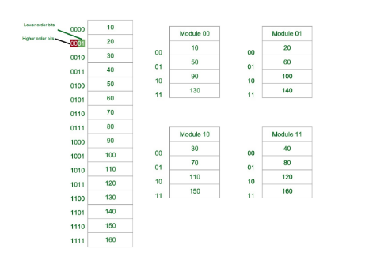

## Log0906

#### OverHead

>   We define **overhead** as the time it takes to perform some operation that you’d ideally want to take zero time

#### Latency

>   There are two common definitions of **latency**. Launch latency**,** sometimes called induction time, is the time between requesting an asynchronous task and beginning to execute it.

#### Workloads

>   In computing, a workload, typically, is any program or application that runs on any computer.

#### Fabric

> A fabric is **a logical group of devices** that is managed as a single entity in one or multiple locations

很多设备组成的实体

#### Hot Plug
> Hot plugging is **the ability to replace or install a device without shutting down the attached computer**.
> Hot plugging is implemented when a peripheral device is added or removed; a device or working system requires reconfiguration; a defective component requires replacement or a device and computer require data synchronization. Hot swapping allows easy accessibility to equipment and the convenience of uninterrupted systems.

#### Memory Interleaving

> In [computing](https://en.wikipedia.org/wiki/Computing), **interleaved memory** is a design which compensates for the relatively slow [speed](https://en.wikipedia.org/wiki/Speed) of [dynamic random-access memory](https://en.wikipedia.org/wiki/Dynamic_random-access_memory) (DRAM) or [core memory](https://en.wikipedia.org/wiki/Core_memory), by spreading memory addresses evenly across [memory banks](https://en.wikipedia.org/wiki/Memory_bank). That way, contiguous memory reads and writes use each memory bank in turn, resulting in higher memory throughput due to reduced waiting for memory banks to become ready for the operations.
>
> ​																														----Wikipedia

