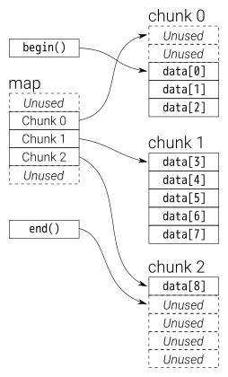

# Standard Template Library in C++

## Basic

- Container
- Iterator
- Algorithm

## Array
- use like fixed array in c++
- use .at() instead of [] to assign data for bound safe

```c++

```

## Vector
- use like dynamic array
- the size of vector double each time the capacity is full

## Forward_list
- use like single linked list in c++

## List
- use like double linked list in c++

## Map
- pairs 
- sorted by key
- unique key
- using self-balance binary tree
- sort with self-defined data type

## Multimap
- pairs 
- sorted by key
- not unique key
- using hashing buckets

## Unordered_map
- pairs 
- not sorted
- unique key

## Unordered_multimap
- pairs
- not sorted 
- not unique key

## Set
- unique item
- sorted 

## Multiset
- not unique item
- sorted

## Unordered_set
- unique item
- not sorted
- using hashing buckets

## Unordered_multiset
- not unique item
- not sorted

## Stack
- well-tested stack implement

## Queue
- well-tested queue implement

## Priority_queue
- the top data is always the largest/smallest data in all datas
- using heap

## Deque
- double-ended queue
- two dereference



## Pair
- bind two data together

## Sort algorithm

### sort
- sort the data
- using intro sort
- the mix of quicksort mergesort and insertsort

### is_sorted
- check whether the data is sorted

### is_sorted_until
- return the index of last sorted data

### n_th element
- use intro sort
- return the nth largest/smallest number

### partical_sort
- only sort the part of data
- the rest of data is undefined and is random

## Reference

1. [CPP-ref](https://en.cppreference.com/w/)