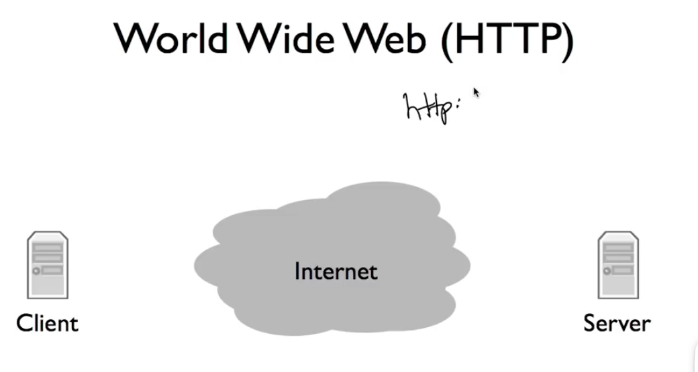
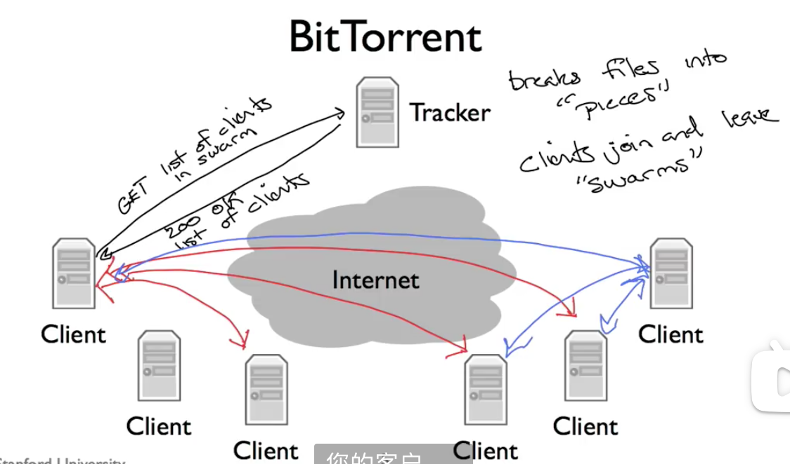
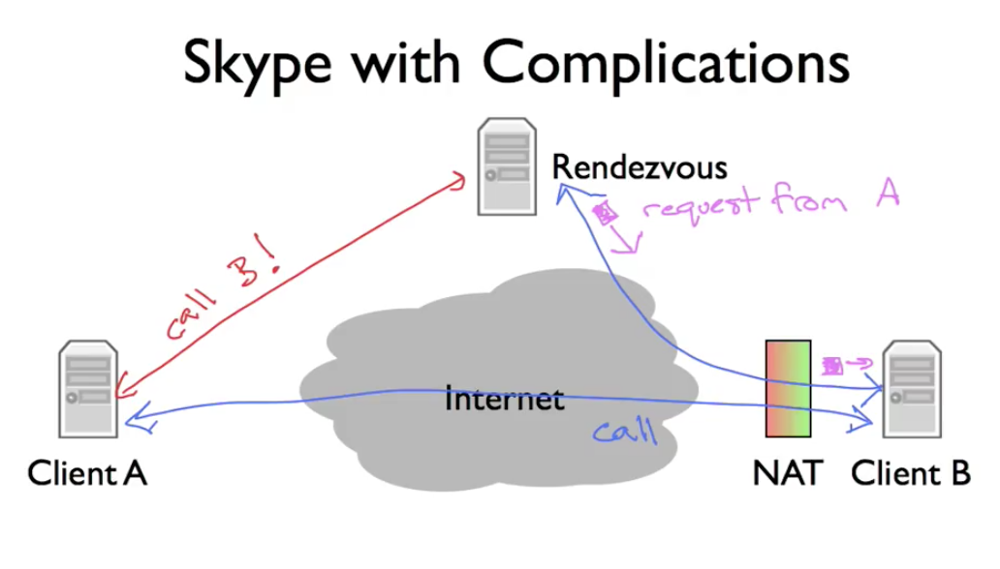

# CS144

#### ==**2023.8.29**==

#### 四种网络应用

-   Byte Stream：两个端口互相读写

-   HTTP：先建立连接再读写

    

-   BitTorrent：一个Tracker和多个Client

    

-   Skype：使用NAT（类似于二极管）B和Re建立连接，A向Re申请call B，B再和A建立连接

    

#### ==**2023.9.5**==

#### 网络四层

#### IP应用

#### packet的传输