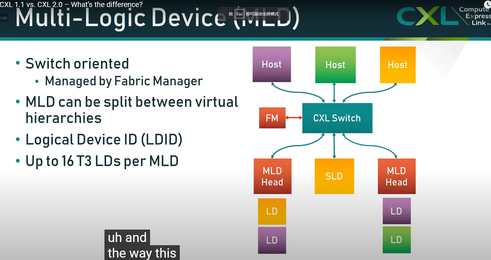

# CXL
## CXL1.1
#### 特性
单机对多个远程
## CXL2.0
#### 特性
scaling the host

#### LD(Logical Devices)

我们将CXL devices 仅仅看作带有一定resources的interfaces，去和CXL Swtich对接。SLD和MLD分别代表该设备被一个或多个终端使用。

MLD下的LD Lid为8bits，top 4 bits通常置0，后4位作为设备的标识。

#### QoS Telememtry

每一次memory transaction，add two bits to say how much the loads

#### hot plug

**hot add**

**hot remove**

## CXL3.0