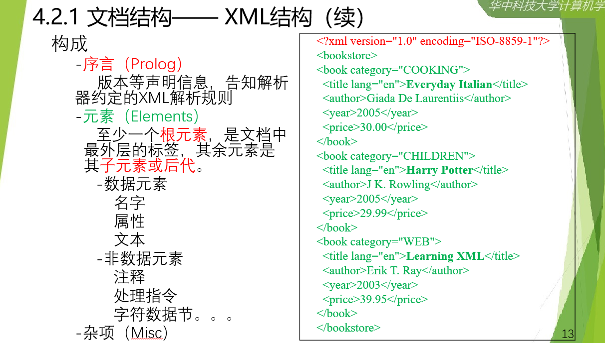

# ==大数据管理==

---

## [第二章：关系数据模型与SQL](./doc/大数据管理ppt/第2章 关系数据模型与SQL-华为拓展V.pptx)

#### ==2023.8.30==

#### 一份CheatSheet复习SQL

[*SQL-Cheatsheet*](./doc/sql-for-data-analysis-cheat-sheet-a4.pdf)

#### SQL新特性

**SQL for xml：**

[*参考及案例*](https://www.codeproject.com/Articles/1189725/FOR-XML-Basics-EXPLICIT-Mode-of)

-   raw模式：将查询结果直接返回
-   auto：合并相同的属性及值
-   explicit：使用别名
-   path：

**SQL for JSON：**

-   读取JSON文件
-   建表并查询
-   写入JSON文件

**MySQL for JSON：**

-   同上

#### 其他

看ppt，比较琐碎

## [第四章：文档模型与查询语言](./doc/大数据管理ppt/第4章 文档模型与查询语言.pptx)

#### ==2023.9.7==

####  *学会使用XML数据格式*

#### 文档结构

**XML结构：**

- DTD：DTD 是一套关于标记符的语法规则,是XML的类型定义

    ```xml-dtd
    <!ELEMENT note (to,from,heading,body)>
    <!ELEMENT to (#PCDATA)>
    <!ELEMENT from (#PCDATA)>
    <!ELEMENT heading (#PCDATA)>
    <!ELEMENT body (#PCDATA)>
    ```

    

- XSL：XSL 之于 XML ，就像 CSS 之于 HTML

- XSLT：XSLT用于将一种XML文档转换为另外一种XML文档，或者可被浏览器识别的其他类型的文档，比如HTML和XHTML。

- XLL：是 XML 链接语言，它提供了 XML 中的链接

- XSD：XML文档的结构定义

    *from Website*



**JSON结构**

#### 查询语言

**DOM接口**

**FLOWR**

**Xquery**

**XPath**

#### 文档数据库

**eXistDB**

**MongoDB**

[MongoDB-CheatSheet](https://www.mongodb.com/developer/products/mongodb/cheat-sheet/)

**MongoDB操作**

## [第五章：第5章 图模型与类SQL查询语言](./doc/大数据管理ppt/第5章 图模型与类SQL查询语言4.0版本V2.pptx)

#### 图数据类型
**标签图**

**属性图**

**OWL**

**知识图谱**

#### 图操作

**图匹配**

-   子图同构
    1.   在target和query图中分别选择一个节点形成原子对
    2.   判断该原子对能否匹配，如果匹配则加入状态

    3.   重复第一步，一般选择上次选择节点的相邻节点

    4.   当query中没有节点时完成匹配

-   VF2算法
    -   剪枝：当原子对中query节点的度大于target时，剪枝该节点


-   支配与skyline
    -   为图数据画出边框线，用line上的点近似支配一片区域的图数据，研究其他的点
-   查询图分解-join
    -   先切成子图碎片，然后再拼接join（确保问题等价）


**图导航**：按照某种规则查询图中的一个序列

#### 面向图数据的类SQL查询语言

**SPARQL**

**Cypher**

