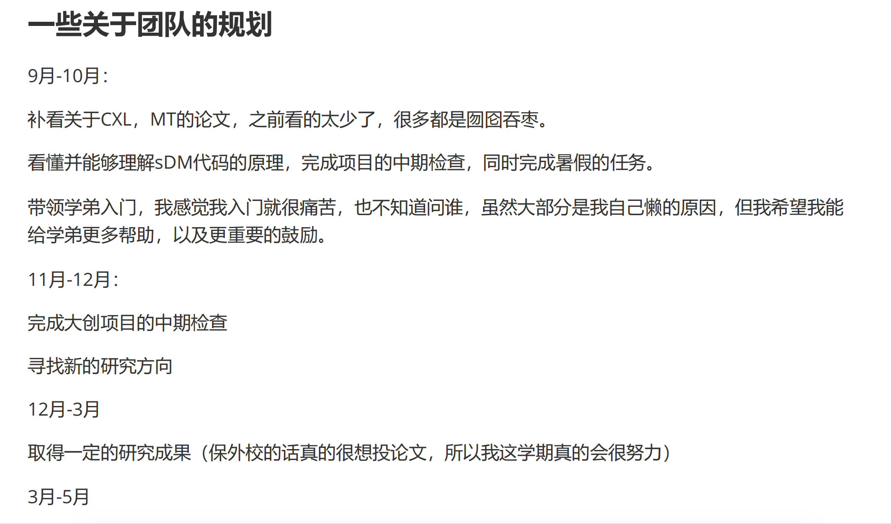

## 23.09.11组会

### 大创规划

### 上周

#### 阅读1+0.5+0.5篇论文

**收获：**复建，了解CXL

**问题：**

-   保留区映射BAR和HDM的策略是什么？

我的思考：

一个host的memory是8GB，那么7ffffffff后面的地址段应该是不存在的，但是通过CXL，后面的地址段变成了真实可以访问的

#### 调研CXL

[Notion文档](https://www.notion.so/eighthalf/74a0ab322e174e7c95168c257089e551?v=11ec3be4d7ce4b83a5ca1f883d3996e3&pvs=4)