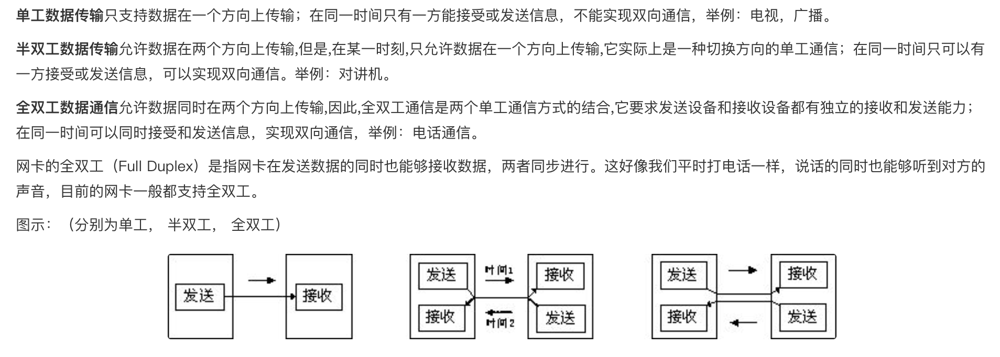
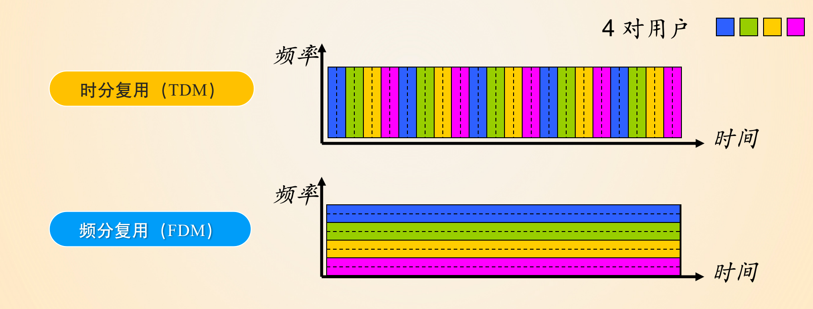
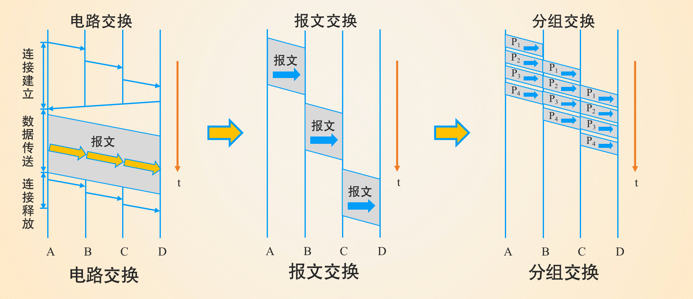
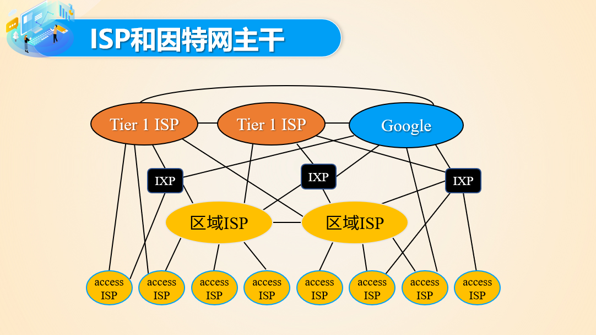
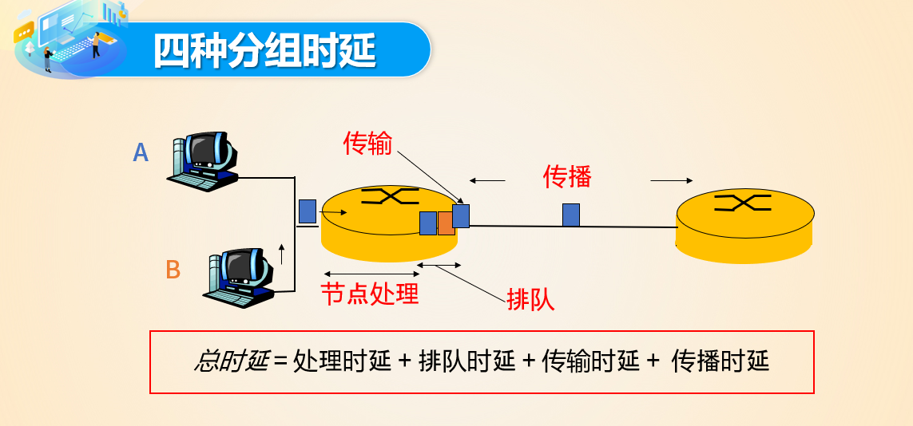
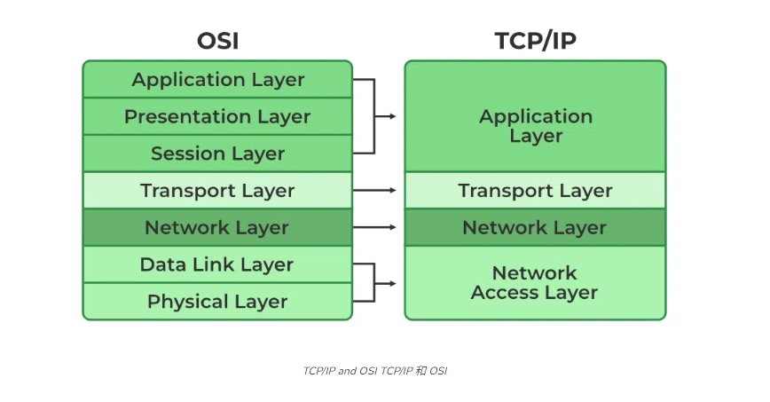
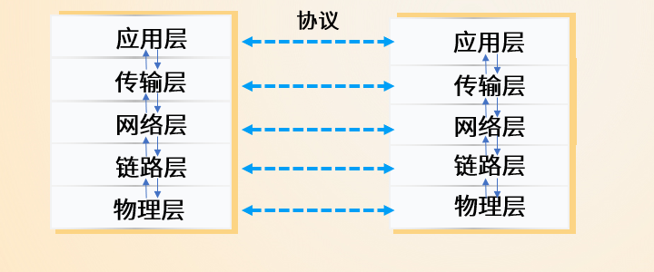
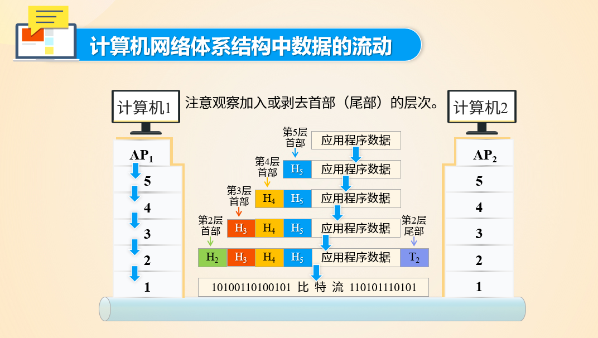

# ==计算机网络==

---

## [第一章：计算机网络和因特网](./doc/计算机网络ppt/第1章 计算机网络与因特网（完整版）.pptx)

#### ==2023.8.30==

#### 网络接入：描述网络接入的方式

**接入介质**

**p2p**

**局域网/城域网/广域网**

**单工/半双工/全双工**：对两端数据交换方式的描述

#### 网络交换

**电路交换：**双方都需要打开连接才能发送数据

电路交换的复用：TDM FDM

**分组交换：**在数据发送到下一个路由（称为下一跳），最后发送到终点端。数据可以切分为更多的组，提升容错率，但同时交换协议会更加复杂。

#### ==**2023.9.7**==

#### 网络核心:

**ISP和互联网主干：**注意IXP，ISP的概念

#### 时延、丢包数和吞吐量

**时延：**四种时延

- 注意区分传输时延和传播时延的区别
- 会计算排队时延

**丢包：**缓冲区溢出采用的策略

**吞吐量：**目前瓶颈集中在主干网络

#### 层次化的网络结构

**TCP/IP层次：**4层

**教材：**5层

- 应用层（Application）:运行不同程序之间的通信，HTTP ==message==
- 传输层（Transport）：不同主机上进程间的数据传输协议。TCP、UDP，保证数据正确传输 ==segement==
- 网络层（Network）：不同局域网，不同主机之间的通信协议，IP ==datagram==
- 链路层（Link）：数据在网络相邻结点之间传输，Ethernet ==data==
- 物理层（Phsical）：将数据转换成物理信号的协议 ==bitstream==

**传输格式的变换：**

链路层加上了校验码（CRC or CheckSum）

**ISO-OSI：**7层

## [第二章：应用层](./doc/计算机网络ppt/第2章 应用层（完整版）.pptx)

#### ==2023.9.11==

#### 应用层协议

#### Web

**Web**

#### HTTP

**连接方式**

**请求报文**

**响应报文**

**cookie**

